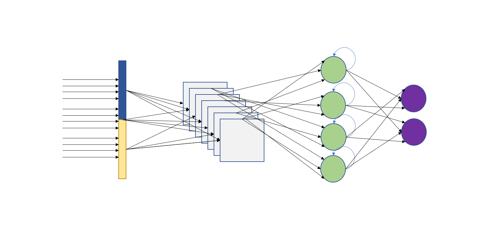

# Sentiment Prediction using CNN and LSTM in Keras



## Using Convolutional and Long Short-Term Memory Neural Networks to Classify IMDB Movie Reviews as Positive or Negative
We will explore combining the CNN and LSTM along with Word Embeddings to develop a classification model with Python and Keras. The data we will look at is the [IMDB Movie Review dataset](https://www.kaggle.com/lakshmi25npathi/imdb-dataset-of-50k-movie-reviews). The data consists of a review (free text) and the sentiment, whether positive or negative.

We will not go in depth on how to deal with text data and preprocess it for modeling. The article focuses on increasing the accuracy of the model. Of course, with more text preprocessing we will achieve better results and it is the best practice.

## Introduction
We will tackle our problem with three different techniques. Word Embeddings, Convolutional and LSTM neural networks. Each technique can fit in a book, or even books, on its own.

[Word Embedding](https://en.wikipedia.org/wiki/Word_embedding) is a technique of natural language processing where the model maps words or phrases to real numbers. Essentially, embeddings are the representation that the model learns from text. Similar words that may have the same meaning, will have a similar representation (with numbers).

[Convolutional Neural Network](https://en.wikipedia.org/wiki/Convolutional_neural_network) is a type of deep neural networks. Famously known for its capabilities in image processing and computer vision. They are excellent at learning the data spatial structure and extracting the characteristics in data.

[Long Short-Term Memory neural network](https://en.wikipedia.org/wiki/Long_short-term_memory) is a special type of Recurrent neural networks. LSTMs are great in capturing and learning the intrinsic order in sequential data as they have internal memory. That’s why they are famous in speech recognition and machine translation.

Now, it is time to get into the data and code!

## Data Preparation
The data we have consists of 50K reviews and their sentiment. We will first read it and look quickly at it.

```python
import pandas as pd
reviews = pd.read_csv("IMDB Dataset.csv")
reviews.head()
#                                               review sentiment
# 0  One of the other reviewers has mentioned that ...  positive
# 1  A wonderful little production. <br /><br />The...  positive
# 2  I thought this was a wonderful way to spend ti...  positive
# 3  Basically there's a family where a little boy ...  negative
# 4  Petter Mattei's "Love in the Time of Money" is...  positive
reviews.shape
# (50000, 2)
```
N.B. It is a good practice to have all your import statements at the beginning of the script. However, here we want to highlight what library every class and function belong to.

Although we won’t do text processing, but the data seems to have some issues. HTML tags. We can easily spot them. However, we need also to remove the words that have no meaning but exist heavily. For example, The, and, or, become, is, be etc. These words can have an undesired effect on the model. So we will remove them.

We will write a function that does the steps and returns a cleaned string.

```python
import re
from sklearn.feature_extraction import text
stop_words = text.ENGLISH_STOP_WORDS
def clean_review(review, stopwords):
    html_tag = re.compile('<.*?>')
    cleaned_review = re.sub(html_tag, "", review).split()
    cleaned_review = [i for i in cleaned_review if i not in stopwords]
    return " ".join(cleaned_review)
## before cleaning
text = reviews.review[0]
print(text[:200])
# One of the other reviewers has mentioned that after watching just 1 Oz episode you'll be hooked. They are right, as this is exactly what happened with me.<br /><br />The first thing that struck me abo
## after cleaning
cleaned_text = clean_review(text, stop_words)
print(cleaned_text[:200])
# One reviewers mentioned watching just 1 Oz episode you'll hooked. They right, exactly happened me.The thing struck Oz brutality unflinching scenes violence, set right word GO. Trust me, faint hearted
## cleaning the review column
reviews["cleaned_review"] = reviews["review"].apply(lambda x: clean_review(x, stop_words))
```
Great! Now we need to convert the text into a sequence of numbers to feed it into the neural network model. We will use Keras’ Tokenizer Class to achieve this. Tokenizer vectorizes a text corpus, by turning each text into a sequence of integers.

```python
from keras.preprocessing.text import Tokenizer
## maximum words to keep based on frequency 
max_features = 5000
## replace out-of-vocab words with this
oov = "OOV"
tokenizer = Tokenizer(num_words = max_features, oov_token = oov)
tokenizer.fit_on_texts(reviews["cleaned_review"])
## convert text into integers
tokenized = tokenizer.texts_to_sequences(reviews["cleaned_review"])
```
Let’s now change the “sentiment” column into integers as well. Here we will use LabelEncoder from Scikit-Learn.

```python
from sklearn.preprocessing import LabelEncoder
def sentiment_encode(df, column, le):
    le.fit(df[column])
    sentiment_le = le.transform(df[column])
    return sentiment_le, le
le = LabelEncoder()
sentiment_le, le = sentiment_encode(reviews, "sentiment", le)
print(len(le.classes_))
# 2
le.classes_
# array(['negative', 'positive'], dtype=object)
```
Perfect!

N.B. We are fitting all transformers on all data, which may not be the best thing to do as we would need to fit on train data then transform test data. So we would need to split data into train and test before all this.

Now we will make sure that all sequences have the same length and truncate them into a maximum length of 500 words only.

```python
from keras.preprocessing import sequence
max_len = 500
Xtrain = sequence.pad_sequences(tokenized, maxlen = max_len)
```
Now, we split our data into train and test. We will split the data into two halves. 25K train and 25K test.

```python
from sklearn.model_selection import train_test_split
## we will do the splitting using a random state to ensure same splitting every time
X_train, X_test, y_train, y_test = train_test_split(Xtrain, sentiment_le, 
                                                    test_size = .5,
                                                    random_state = 13)
```
## Model Development
Now we have everything ready for the model.

The first layer of our model is the Embedding Layer which will try to learn the text representation and represent it in the specified number of vectors. Next, we add a one-dimensional CNN to capture the invariant features of a sentiment. Then we pass the learned features to an LSTM so that it learns them as sequences. We may add some dropout to avoid overfitting and a Bidirectional LSTM to improve performance.

```python
## importing
from keras.models import Sequential
from keras.layers import Dense, LSTM, Bidirectional, Dropout
from keras.layers.embeddings import Embedding
from keras.layers.convolutional import Conv1D, MaxPooling1D
## model parameters
vocab_size = max_features #5000
embedding_dims = 128 # dimensions to which text will be represented
num_epochs = 3
noutput = len(le.classes_) #2 (binary)
## model
model = Sequential()
# embedding layer (vocab_size is the total number of words in data,
# then the embedding dimensions we specified, then the maximum length of one review)
model.add(Embedding(vocab_size, embedding_dims, input_length = max_len))
# CNN
model.add(Conv1D(128, kernel_size = 4, input_shape = (vocab_size, embedding_dims),
                 activation = "relu"))
# max pooling layer
model.add(MaxPooling1D(pool_size = 3))
# bidirectional LSTM
model.add(Bidirectional(LSTM(64, return_sequences = True)))
# LSTM and droput
model.add(LSTM(32, recurrent_dropout = 0.4))
model.add(Dropout(0.2))
# 1 neuron output layer and sigmoid activation (binary 0 or 1)
model.add(Dense(noutput - 1, activation = "sigmoid"))
# model summary and layout
model.summary()
# Model: "sequential"
# _________________________________________________________________
# Layer (type) Output Shape Param #
# =================================================================
# embedding (Embedding) (None, 500, 128) 640000
# _________________________________________________________________
# conv1d (Conv1D) (None, 497, 128) 65664
# _________________________________________________________________
# max_pooling1d (MaxPooling1D) (None, 165, 128) 0
# _________________________________________________________________
# bidirectional (Bidirectional (None, 165, 128) 98816
# _________________________________________________________________
# lstm_1 (LSTM) (None, 32) 20608
# _________________________________________________________________
# dropout (Dropout) (None, 32) 0
# _________________________________________________________________
# dense (Dense) (None, 1) 33
# =================================================================
# Total params: 825,121
# Trainable params: 825,121
# Non-trainable params: 0
# _________________________________________________________________
```
Now it is time to fit and run the model:

```python
# adam optimizer and binary crossentropy
model.compile(loss = "binary_crossentropy", metrics = ["accuracy"],
              optimizer = "adam")
model.fit(X_train, y_train, epochs = num_epochs,
          batch_size = 32,
          validation_data = (X_test[:1000], y_test[:1000]),
          verbose = 1)
# Epoch 1/3
# 782/782 [==============================] - 184s 223ms/step - loss: 0.4652 - accuracy: 0.7526 - val_loss: 0.3489 - val_accuracy: 0.8070
# Epoch 2/3
# 782/782 [==============================] - 163s 208ms/step - loss: 0.2253 - accuracy: 0.9151 - val_loss: 0.3334 - val_accuracy: 0.8600
# Epoch 3/3
# 782/782 [==============================] - 185s 237ms/step - loss: 0.1525 - accuracy: 0.9496 - val_loss: 0.3093 - val_accuracy: 0.8660
```
Very Good! Pretty good results with fairly simple implementation. Of course with more data transformation especially text and adjusting the model parameters, the model can achieve better results.

## Model Evaluation
Let’s now evaluate the performance of our model on the test data.

```python
results = model.evaluate(X_test[1000:], y_test[1000:])
# 750/750 [==============================] - 51s 65ms/step - loss: 0.3550 - accuracy: 0.8637
print("test loss: %.2f" % results[0])
# test loss: 0.36
print("test accuracy: %.2f%%" % (results[1] * 100))
# test accuracy: 86.37%
```
The model is performing very well on the test data.

P.S. your result may somewhat vary.